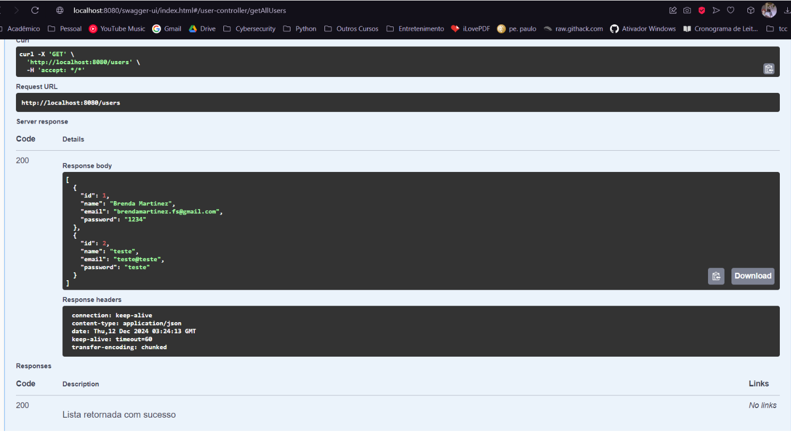
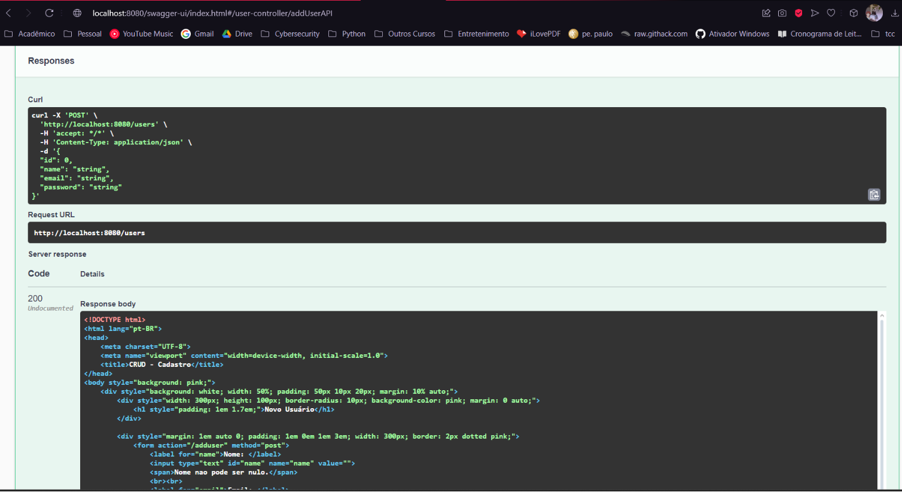
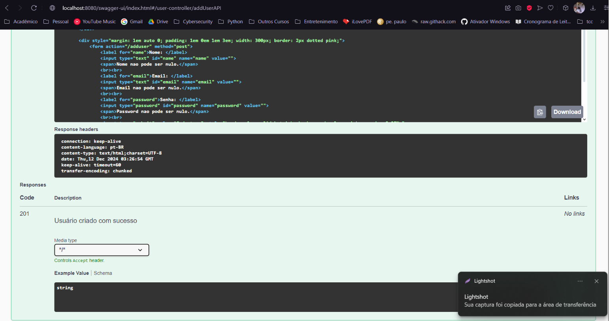

# Microsserviço: api de usuário

### Objetivo

1. Criar dois microsserviços independentes:
    - Um serviço de API (App) para gerenciar usuários.
    - Um serviço de "banco de dados" que armazena usuários.
2. Integrar os serviços e testar usando ferramentas como Postman ou Swagger.

### Requisitos

1. Linguagem: Java.
2. Banco de Dados: H2
3. API RESTful: endpoints solicitados:
    - GET /users: Retorna uma lista de usuários.
    - POST /users: Adiciona um novo usuário.
4. Teste: Rodar localmente e testar com Postman ou Swagger.

### Tecnologias

1. Spring Boot: Para criar a API.
2. Spring Data JPA: Para manipulação do banco de dados.
3. H2 Database: Banco de dados embutido.

### Estrutura do Projeto

1. User: Entidade representando o usuário.
2. UserRepository: Interface de acesso ao banco de dados.
3. UserService: Lógica de negócios.
4. UserController: Controlador REST.

### Acessar Banco de Dados

- URL: http://localhost:8080/h2-console
- JDBC URL: jdbc:h2:mem:testdb
- User: sa
- Password:

### Acessar o Swagger UI:

- URL: http://localhost:8080/swagger-ui.html

### Meus testes

- GET \users

- POST \users

### Deploy
[https://brenda-martinez-ads-ifba-devops-a1.onrender.com/index](https://brenda-martinez-ads-ifba-devops-a1.onrender.com/index)
